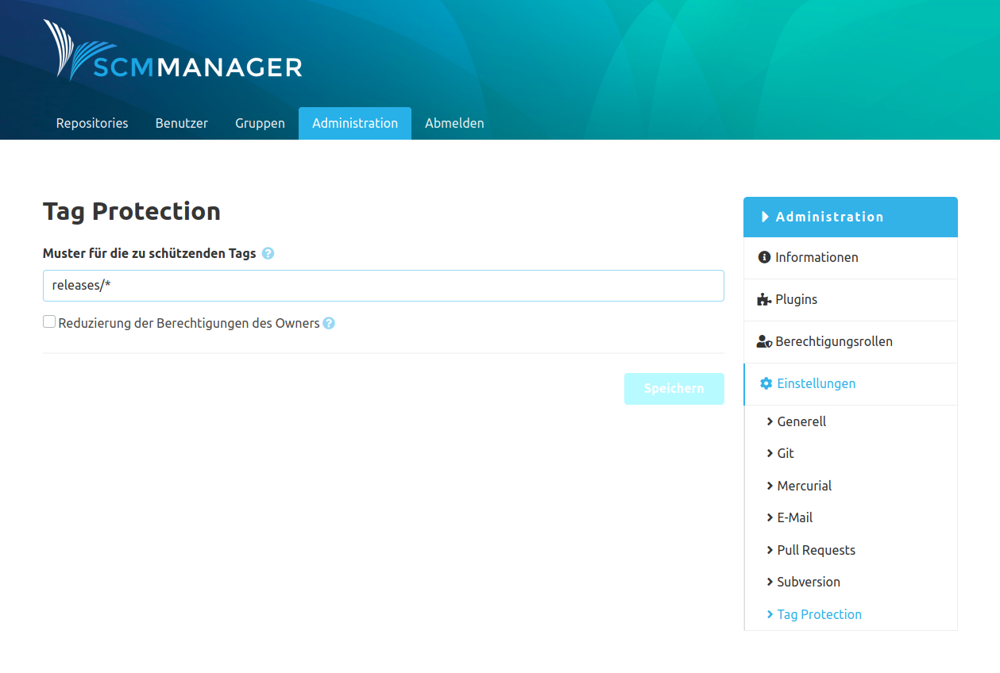

Die durch das Plugin erzeugte Konfiguration "Tag Protection" ist über die globalen Einstellungen aufrufbar.

In diesem Abschnitt lassen sich Muster für die zu schützenden Tags erstellen. Dabei können folgende Platzhalter verwendet werden:

* "*\\" für ein oder mehrere Zeichen
* "?" für ein einzelnes Zeichen

Außerdem lassen sich die Berechtigungen des Owners reduzieren. Benutzer, die die Berechtigung haben ein Repository zu verändern (z.B. Owner), können jeden Tag in dem Repository entfernen. Geschützte Tags können bei aktivierter Option dann auch von diesen Benutzern nicht entfernt werden.
