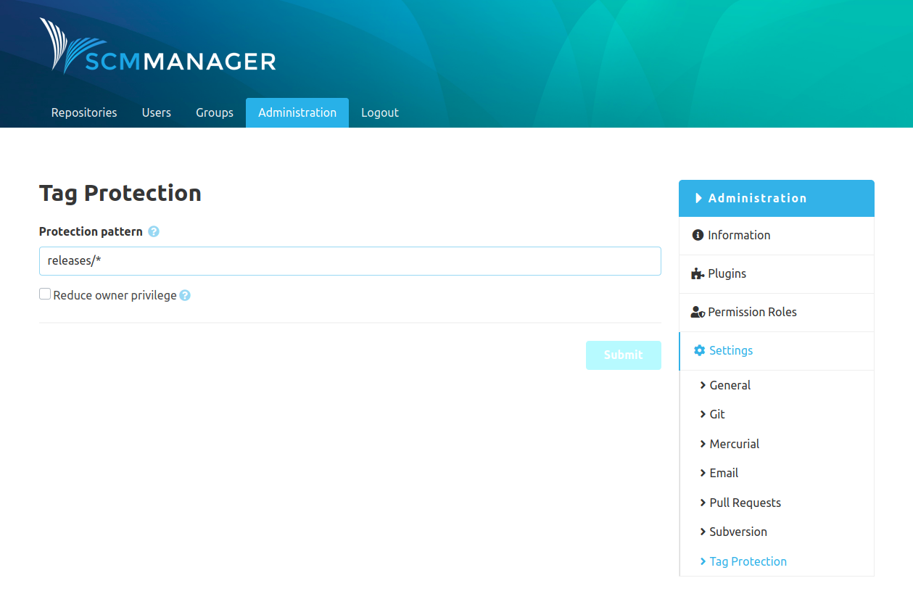

Once the plugin is installed, there is the "Tag Protection" item in the global settings.

### Protection Pattern

It is possible to create patterns for tags that should be protected. These wildcards are available:

* "*\" for one or more characters
* "?" for a single character

This is enables you to protect, for example `releases/*` or simply `*` to effectively disable tag removal at all.

### Reduce Owner Privilege

Additionally, it is possible to reduce the permissions of the owner. Users that have the permission to modify a repository (e.g. owners) can delete any tag in the repository. If this option is activated, even those users can’t delete protected tags.
